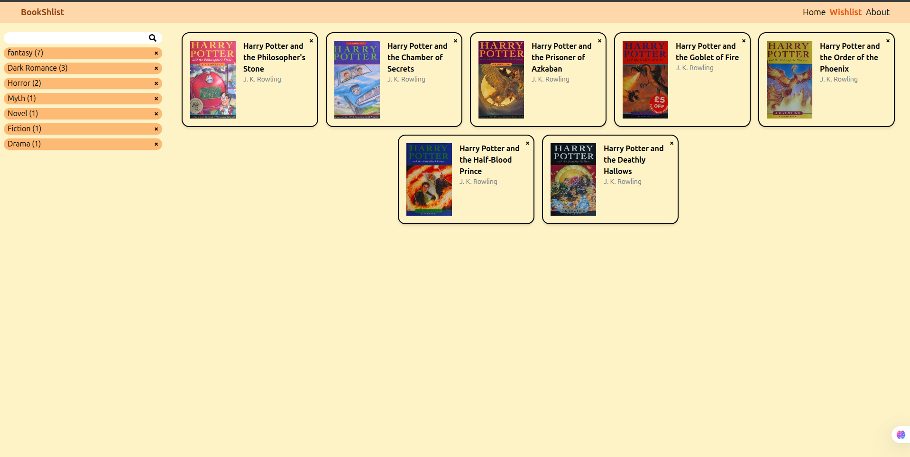

# 📚 BookShlist

A book wishlist app where you can search for books, organize them into custom lists, and keep track of what you want to read next.

🔗 **Live demo:** [bookshlist.vercel.app](https://bookshlist.vercel.app)



## Features

- 🔍 Live search across a large book database (Open Library API)
- 📝 Create multiple wishlists to organize books by genre or category
- 📖 Add and remove books from any wishlist
- 🚫 Duplicate protection — the same book can't be added twice to one list
- 💾 Persistent storage via localStorage
- 📱 Fully responsive layout (mobile, tablet, desktop)
- ✅ Tested with Vitest and React Testing Library

## Tech Stack

- React + Vite
- TypeScript
- Tailwind CSS
- Vitest / React Testing Library
- Open Library API

## Running locally

```bash
git clone https://github.com/GettMaaz/bookshlist.git
cd bookshlist
npm install
npm run dev
```

## Running tests

```bash
npm run test
```